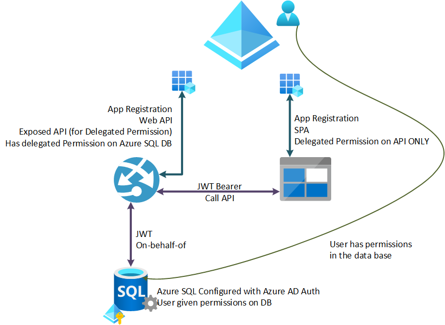
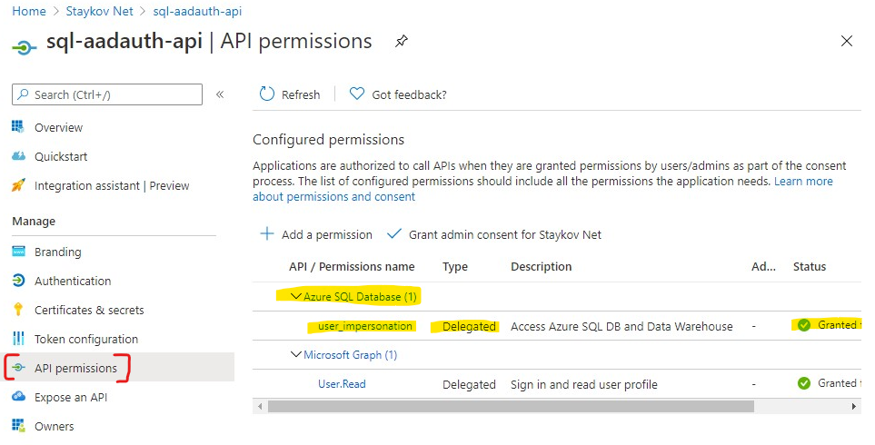
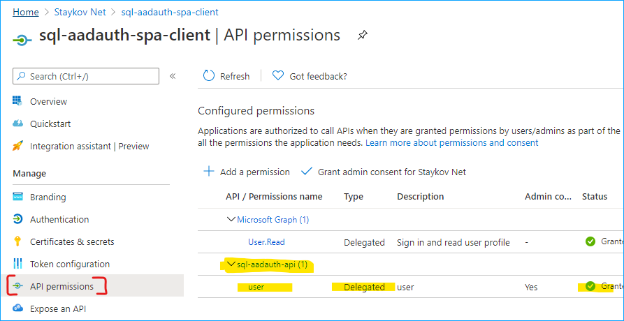
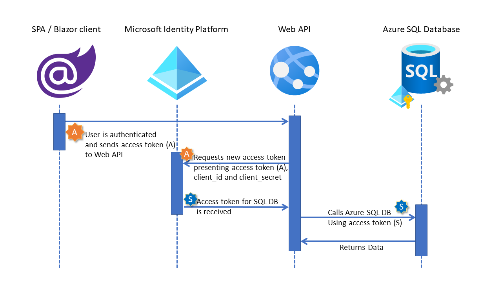

# Azure AD Authentication for Azure SQL Database for Endusers with SPA client and Web API
This sample represent the cleanest possible plain implementation of Azure AD Authentication for Azrue SQL Database for endusers in a SPA -> WebAPI environment.
The detail that is covered here is the use of `on-behalf-of` flow. The whole implementation is based on the following diagram:



We have the following components and their respective configuration:

 * Azure SQL DB configured with Azure AD Authentication ([how to](http://bit.ly/as-sql-auth-config)). Do not forget to add all your required users to the database ([how to](http://bit.ly/as-sql-auth-adduser))
 * An ASP.NET Core 3.1 Web API configured for JWT Bearer Protection using [Microsoft.Identity.Web NuGet Package](http://bit.ly/as-sql-auth-miw) ([how to](http://bit.ly/as-sql-auth-webapi)). The Azure AD App Registration for this Web API has been also granted the `delegated` permission `user_impersonation` on `Access Azure SQL DB and Data Wharehouse`. Your WebAPI application registration in Azure AD must look similar to the following picture regarding `API Permissions`:

    

 * A SPA client application (plain JavaScript, no special JS Frameworks) using [MSAL.JS](http://bit.ly/as-sql-auth-msaljs) (msal-browser) configured separately in Azure AD. This client application has its own application registration with SPA platform. Additionally it has permissions on Web API application registration. The latter is required in order to properly obtain an `access token` to call the Web API. Sample code is based on the original sample from MSAL.JS [here](http://bit.ly/as-sql-auth-msaljs-sample). The only modification is that we now call our own API and not MS Graph. Application registration in Azure for the SPA Client would look similar to this with respect to `API premissions`:

   

 * The gluing part of the whole process is the use of [OAuth 2.0 On-behalf-of](http://bit.ly/as-sql-auth-obhealfof) flow. In our case we have the following diagram:

   

## Simplified authentication flow:

 1. User opens browser ans navigates to the SPA / Blazor client
 2. SPA / Blazor client authenticates the user and obtains an access token (a) for the Web API
 3. SPA / Blazor client calls the Web API using the access token in `Authorization` header.
 4. Web API verifies the access token and uses `On-Behalf-Of` flow to get **new** `access token` (S) for Azure SQL DB (`scope=https://sql.azuresynapse-dogfood.net/user_impersonation`) (using [MSAL.NET](http://bit.ly/as-sql-auth-msalnet)):

```csharp
IConfidentialClientApplication clnt = ConfidentialClientApplicationBuilder
    .Create(_config.GetValue<string>("AzureAd:ClientId"))
    .WithClientSecret(_config.GetValue<string>("AzureAd:ClientSecret"))
    .WithAuthority(AadAuthorityAudience.AzureAdMyOrg)
    .WithTenantId(_config.GetValue<string>("AzureAd:TenantId"))
    .Build();
UserAssertion ua = new UserAssertion(token);

var res = clnt.AcquireTokenOnBehalfOf(new string[] { "https://sql.azuresynapse-dogfood.net/user_impersonation" }, ua)
    .ExecuteAsync().Result;
```

 5. Web API uses the new access token (S) in their connections string and opens a connection to SQL DB:

```csharp
SqlConnectionStringBuilder builder = new SqlConnectionStringBuilder();

builder.DataSource = "db-server.database.windows.net";
builder.InitialCatalog = "db-name";

using (SqlConnection connection = new SqlConnection(builder.ConnectionString))
{
    /**
        * Use the new access token - obtained using on-behalf-of flow
        * with the SQL Database
        * **/
    connection.AccessToken = res.AccessToken;
    connection.Open();
}

```

## Configuration locations

The Web API configuration is entirely located in [appsettings.json](./Core-WebApi/appsettings.json) file:

```json
"AzureAd": {
    "Instance": "https://login.microsoftonline.com/",
    "Domain": "your-domain.onmicrosoft.com",
    "TenantId": "<your-tenant-guid>",
    "ClientId": "<client_id-of-webapi-app-registration>",
    "ClientSecret": "<client_secret-of-webapi-app-registration>"
}
```

SPA Client configuration is located in [apiConfig.js](./spa/apiConfig.js) file, which is rather simple:

```js
// Add here the endpoints for your API services you would like to use.
const apiConfig = {
    apiEndpoint: "https://full-url-path-to-the-web-api-project-hosting-platform/api/sql"
};
```

The MSAL.JS authentication configuration for the SPA client is located in [authConfig.js](./spa/authConfig.js) file:

```js
const msalConfig = {
    auth: {
        clientId: "<client_id-of-spa-app-registration>", // the client_id of your SPA app registration
        authority: "https://login.microsoftonline.com/yourdomain.onmicrosoft.com",
        redirectUri: "full-path-to-url-where-spa-is-hosted",
    },
    cache: {
        cacheLocation: "sessionStorage", // This configures where your cache will be stored
        storeAuthStateInCookie: false, // Set this to "true" if you are having issues on IE11 or Edge
    },
    system: {
        loggerOptions: {
            loggerCallback: (level, message, containsPii) => {
                if (containsPii) {	
                    return;	
                }	
                switch (level) {	
                    // removed for readibility
                }
            }
        }
    }
};

// Add here the scopes that you would like the user to consent during sign-in
const loginRequest = {
    scopes: ["api://3493e330-9c89-4621-910f-ecac5b4a97ba/user"] //this is the *scope* string for the exposed scope of WebAPI app registration
};

// Add here the scopes to request when obtaining an access token for MS Graph API
const tokenRequest = {
    scopes: ["api://3493e330-9c89-4621-910f-ecac5b4a97ba/user"], //this is the *scope* string for the exposed scope of WebAPI app registration
    forceRefresh: false // Set this to "true" to skip a cached token and go to the server to get a new token
};
```

If you have any questions regarding this sample, please submit an issue with this project!